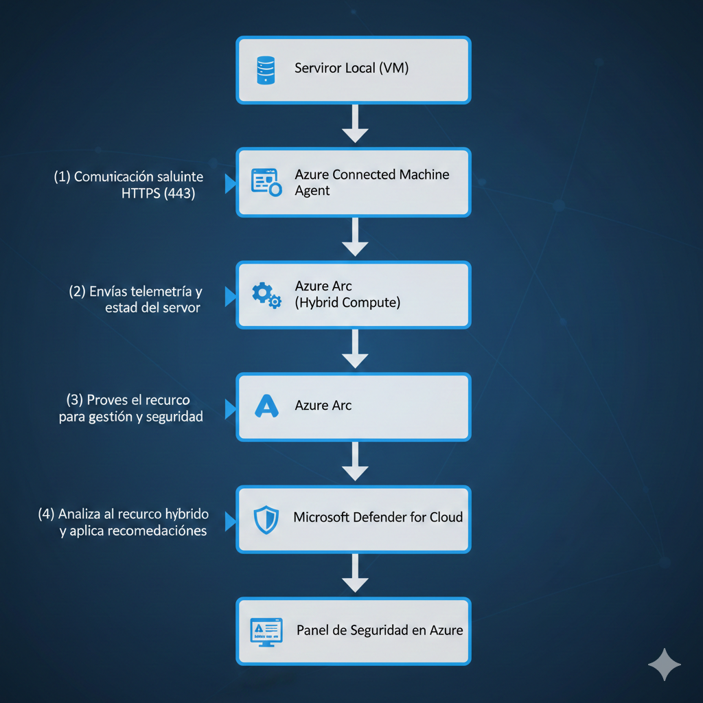
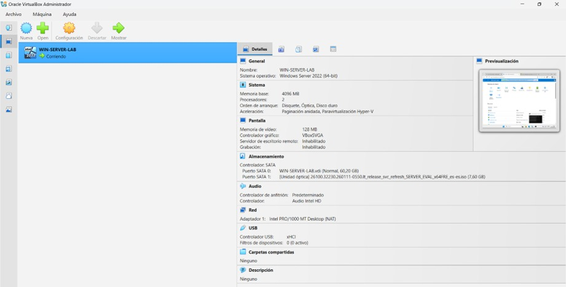
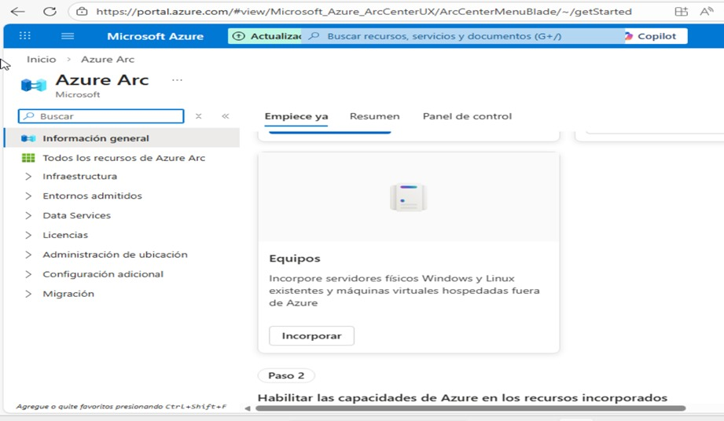
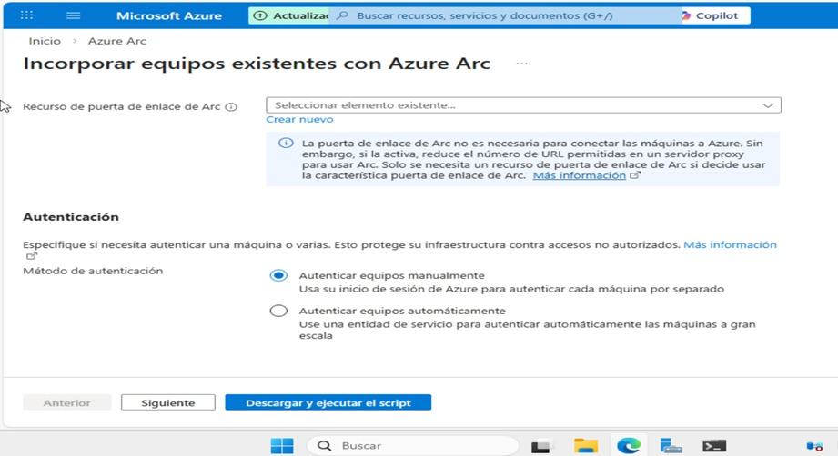
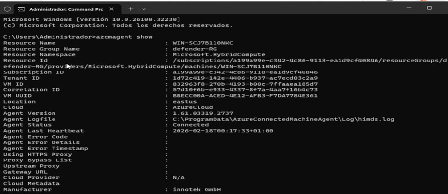
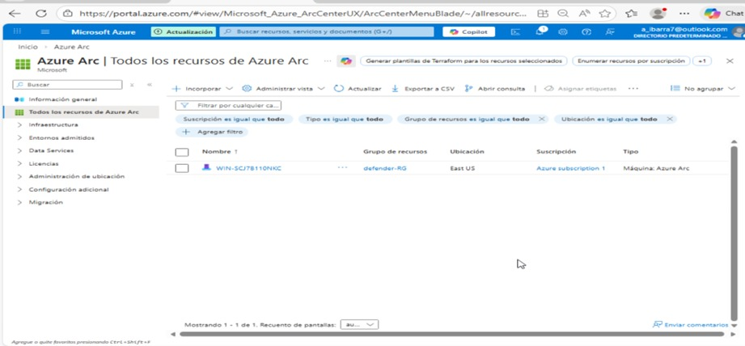

# 📘 Integración de Servidor On-Premises con Azure mediante Azure Arc  
## 🛡️ Laboratorio SC-200 — Integración con Microsoft Defender for Cloud

---

## 1. Resumen Ejecutivo

Este laboratorio documenta la integración de un servidor local (*on-premises*) con Microsoft Azure utilizando **Azure Arc**, permitiendo su administración centralizada desde la nube y la habilitación de capacidades avanzadas de seguridad mediante **Microsoft Defender for Cloud**.

El escenario simula un entorno empresarial híbrido donde la infraestructura local requiere:

- Supervisión centralizada  
- Control de cumplimiento normativo  
- Protección avanzada contra amenazas  
- Gestión unificada desde Azure  

---

## 2. Objetivos Técnicos

- Simular un servidor on-premises utilizando VirtualBox.
- Registrar el servidor en Azure mediante Azure Arc.
- Validar la instalación del Azure Connected Machine Agent.
- Integrar el servidor con Microsoft Defender for Cloud.
- Verificar el estado y conectividad del recurso híbrido.

---

## 3. Arquitectura del Entorno

### 3.1 Componentes

| Componente | Función |
|------------|----------|
| Host físico | Equipo local que ejecuta el laboratorio |
| VirtualBox | Plataforma de virtualización |
| VM Windows | Servidor on-premises simulado |
| Azure Subscription | Entorno cloud del laboratorio |
| Azure Arc | Gestión híbrida |
| Defender for Cloud | Seguridad y protección |

---

### 3.2 Flujo de Conectividad



# 4. 🖥️ Fase 1 — Preparación del Entorno Local

## 4.1 Instalación de VirtualBox

Se instaló VirtualBox para simular infraestructura fuera de Azure.

### Propósito
Recrear un entorno híbrido realista donde el servidor no se encuentra alojado en la nube.

---

## 4.2 Creación de la Máquina Virtual

### Configuración aplicada

| Parámetro | Valor |
|-----------|-------|
| Sistema Operativo | Windows Server / Windows 10 |
| RAM | 4 GB |
| CPU | 2 vCPU |
| Disco | 40 GB |
| Red | NAT con acceso a Internet |

### Resultado

Servidor local operativo con conectividad saliente hacia Internet, requisito esencial para Azure Arc.



---

# 5. ☁️ Fase 2 — Configuración Inicial en Azure

## 5.1 Acceso al Portal

Se accedió a:

https://portal.azure.com

---

## 5.2 Validación de Datos Clave

| Parámetro | Valor |
|-----------|--------|
| Suscripción | Azure subscription 1 |
| Resource Group | defender-RG |
| Región | East US |

Estos parámetros definen el contexto administrativo del recurso híbrido.

---

# 6. 🔗 Fase 3 — Incorporación del Servidor a Azure Arc

## 6.1 Concepto Técnico

Azure Arc permite registrar servidores externos en Azure mediante el **Azure Connected Machine Agent**, creando un recurso del tipo:

`Microsoft.HybridCompute/machines`

Esto habilita:

- Inventario centralizado
- Gestión de políticas
- Monitoreo
- Integración con Defender
- Control RBAC

---

## 6.2 Acceso al Servicio

En el portal de Azure:

1. En la barra de búsqueda escribe **Azure Arc**.
2. Selecciona la opción **Equipos (Incorporar)** para continuar con el proceso de incorporación del servidor.



---

## 6.3 Configuración del Onboarding

### 6.3.1 Detalles del Proyecto

| Campo | Valor |
|--------|--------|
| Suscripción | Azure subscription 1 |
| Grupo de recursos | defender-RG |

**Función:**  
Define el contexto de administración y permisos del recurso.

---

### 6.3.2 Detalles del Servidor

| Campo | Valor |
|--------|--------|
| Región | East US |
| Sistema Operativo | Windows |

> Aunque el servidor es local, su representación lógica en Azure reside en la región seleccionada.

---

### 6.3.3 SQL Server

Opción disponible:

Conectar automáticamente instancias SQL Server a Azure Arc.

En este laboratorio:  
No se habilitó.

---

### 6.3.4 Método de Conectividad

Seleccionado:

Public Endpoint (Conexión directa a Internet)

No se configuró:

- Proxy
- Arc Gateway

**Justificación:**  
La VM contaba con acceso a Internet mediante NAT.

---

### 6.3.5 Método de Autenticación

Seleccionado:

Autenticación manual

**Motivo:**

- Entorno de laboratorio
- Un único servidor
- No se requiere automatización masiva



---

## 6.4 Descarga del Script

Se seleccionó:

Download and run script

Azure generó un script PowerShell personalizado para la incorporación.

---

# 7. 🖥️ Fase 4 — Ejecución en el Servidor Local

## 7.1 Apertura de PowerShell

En la máquina virtual, abra **PowerShell como Administrador**:

```powershell
Run as Administrator
```
## 7.2 Ejecución del Script de Onboarding

Pegue y ejecute en PowerShell (con privilegios de administrador) el script proporcionado por Azure:

```powershell
.\OnboardingScript.ps1
```

Durante la ejecución se realiza automáticamente:


Descarga del agente

- Instalación del servicio
- Registro del servidor en Azure
- Solicitud de autenticación con credenciales de Azure

## 7.3 Verificación del Estado del Agente

Abra CMD como administrador y ejecute:

```CMD
azcmagent show
```

Resultado esperado:

```CMD
Status: Connected
```





