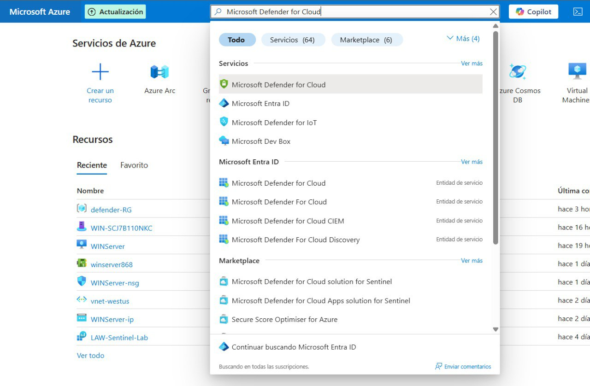
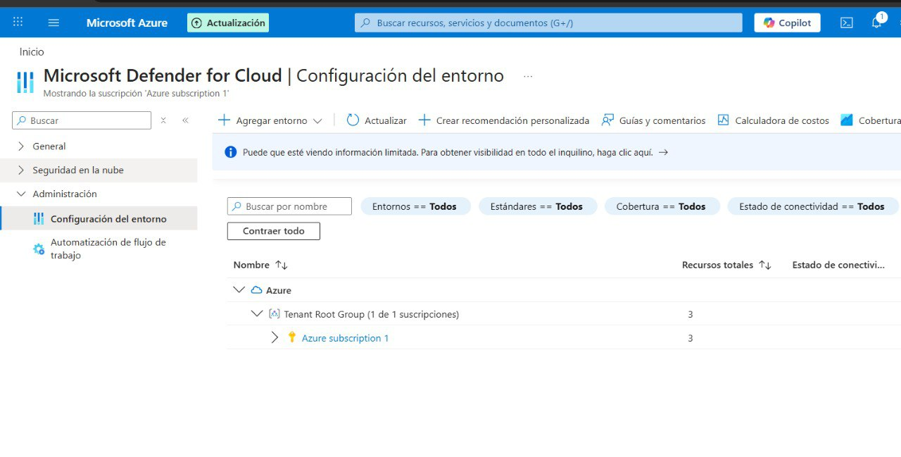
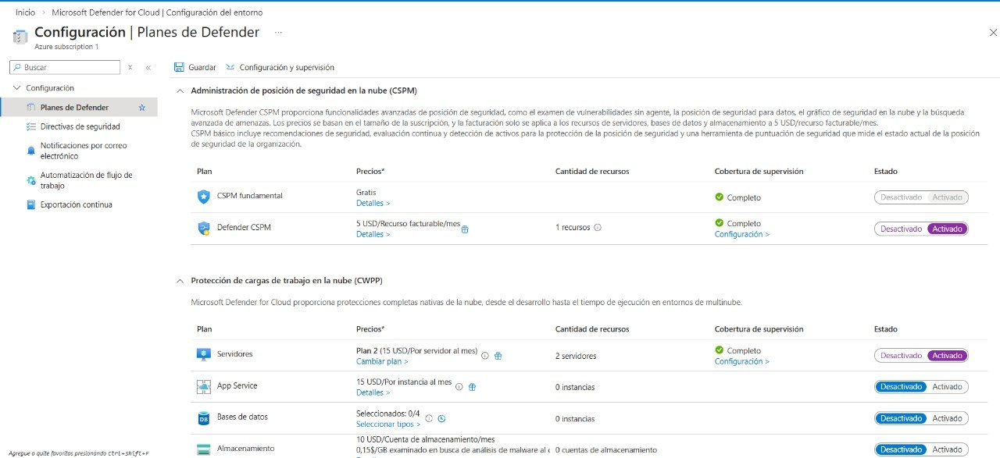
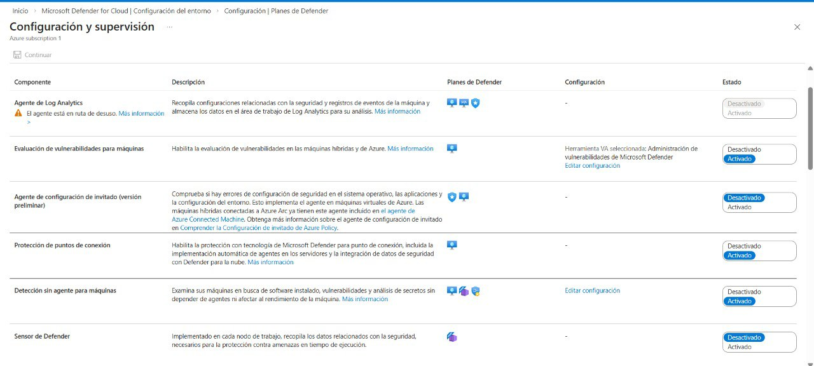
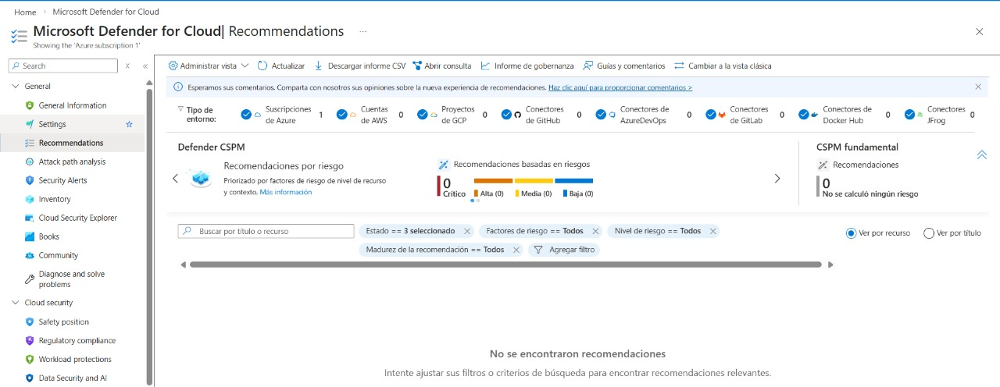

# 🛡️ Taller 2 — Habilitar Microsoft Defender for Cloud  

## Descripción
En este laboratorio se habilitó y validó **Microsoft Defender for Cloud** en una suscripción de Azure, activando las capacidades de **Cloud Security Posture Management (CSPM)** y **Cloud Workload Protection (Servers Plan 2)**.

El objetivo fue verificar que la suscripción quedara protegida y que la postura de seguridad comenzara a evaluarse correctamente.

---

## Objetivos del laboratorio

- Acceder al portal de Azure desde la máquina virtual
- Habilitar Microsoft Defender for Cloud
- Activar Defender CSPM
- Activar Defender for Servers Plan 2
- Verificar recomendaciones y estado de seguridad

---

## 1. Acceder al portal de Azure

1. Abrir **Microsoft Edge**  
2. Navegar a: https://portal.azure.com  
3. Iniciar sesión con las credenciales del tenant del laboratorio  

---

## 2. Abrir Microsoft Defender for Cloud

1. En la barra de búsqueda del portal escribir **Defender**  
2. Seleccionar **Microsoft Defender for Cloud**

---

## 3. Acceder a Environment settings

1. En el menú izquierdo seleccionar:  
   **Configuración → Planes de Defender**  
2. Seleccionar la suscripción del laboratorio  
   (por ejemplo, **Azure subscription 1** o **MOC Subscription**)  

---

## 4. Habilitar planes de seguridad

### 4.1 Activar Defender CSPM
En la sección **Administración de posición de seguridad en la nube (CSPM)**:

- Cambiar el estado a **Activado**

### 4.2 Activar Defender for Servers Plan 2
En la sección **Protección de cargas de trabajo en la nube**:

- Plan: **Servidores Plan 2**  
- Estado: **Activado**

### 4.3 Guardar configuración
Seleccionar **Guardar** para aplicar los cambios.

---

## 5. Validar monitoreo

1. Abrir la pestaña **Settings & monitoring**  
2. Verificar extensiones de:
   - Virtual Machines
   - Containers
   - Storage  
3. Cerrar la ventana  

---

## Verificación de la configuración

### Revisar recomendaciones

Ruta:  
**Defender for Cloud → Recomendaciones**

Resultado observado:

- No se encontraron recomendaciones  
- El sistema está evaluando la suscripción  

Esto confirma que CSPM está activo y funcionando.

---

## Resultado final

La suscripción quedó protegida con:

- Microsoft Defender CSPM habilitado  
- Defender for Servers Plan 2 activo  
- Evaluación de postura de seguridad en ejecución  
- Portal mostrando estado y recomendaciones  

---

## Observaciones

- En entornos nuevos es normal que no existan recomendaciones inicialmente  
- El análisis puede tardar algunos minutos en completarse  
- La interfaz actual de Azure muestra los planes en **Planes de Defender**
  (anteriormente denominado *Pricing & Settings*)  

---

## Conclusión

Se habilitó correctamente Microsoft Defender for Cloud, activando las capacidades de protección y evaluación de seguridad en la suscripción de Azure.

Esto permite identificar riesgos, mejorar la postura de seguridad y proteger cargas de trabajo en la nube.

---

## Tecnologías utilizadas

- Microsoft Azure  
- Microsoft Defender for Cloud  
- Cloud Security Posture Management (CSPM)  
- Cloud Workload Protection (CWP)

---

