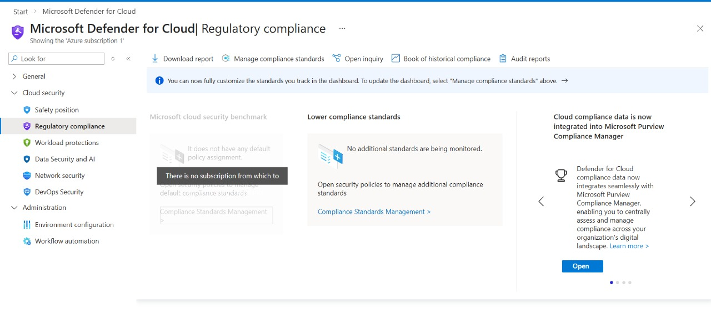
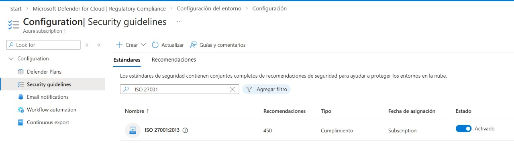

# Configuración y Activación del Estándar ISO 27001 en Microsoft Defender for Cloud

## Descripción

Este procedimiento documenta el proceso para acceder, revisar y, si es necesario, activar el estándar de cumplimiento **ISO 27001:2013** dentro de **Microsoft Defender for Cloud**, como parte del laboratorio de seguridad en Azure.

El objetivo es verificar el estado de cumplimiento y comprender cómo Defender for Cloud evalúa los controles de seguridad basados en estándares internacionales.

---

## Objetivo

- Acceder al panel de cumplimiento normativo.
- Identificar el estándar ISO 27001.
- Revisar recomendaciones y controles.
- Activar el estándar en caso de no estar habilitado.

---

## Ruta de navegación

Azure Portal → Microsoft Defender for Cloud → Regulatory compliance

---

## Procedimiento Paso a Paso

### 1. Acceder a Microsoft Defender for Cloud

1. Ingresar al **Azure Portal**.
2. Buscar **Microsoft Defender for Cloud**.
3. Abrir el servicio.
4. Se abrirá el panel de configuración

### 3. Ir al panel de cumplimiento

1. En el menú lateral seleccionar **Regulatory compliance**.
2. seleccionamos Manage compliance standards

### 4. Acceder a la configuración de la suscripción

1. Dentro de **Environment settings**
2. Seleccionar la suscripción  Azure subscription 1
   

   
# 5 Revisar estándares en Security guidelines

1. Seleccionar **Security guidelines**
2. Se mostrará la lista de estándares disponibles
3. Utilizar la barra de búsqueda.
4. Seleccionar **ISO 27001:2013**.
   

### 5. Revisar controles y recomendaciones

Dentro del estándar podrá observar:

- Controles en estado **Audit** o **Manual**.
- Políticas asociadas a Azure Policy.
- Recomendaciones de seguridad.

*Nota:* Estas recomendaciones ayudan a mejorar la postura de seguridad del entorno.

---

## Activar el estándar (si no está habilitado)

En algunos entornos el estándar no se encuentra activo por defecto.

### Procedimiento

1. Acceder a **Environment settings**.
2. Seleccionar la suscripción correspondiente.
3. Ir a **Security guidelines**.
4. Buscar el estándar **ISO 27001:2013**.
5. Abrir el estándar para revisar sus controles y recomendaciones.

> Nota: En entornos de laboratorio, el estándar puede estar habilitado automáticamente, por lo que no aparecerá la opción **Add standard**.

---

## Resultado esperado

- El estándar ISO 27001 aparece en el panel de cumplimiento.
- Se muestran recomendaciones de seguridad.
- Defender for Cloud inicia la evaluación del entorno.

---

## Notas importantes

- La evaluación puede tardar algunos minutos en reflejar resultados.
- Algunos controles requieren configuración manual.
- El cumplimiento depende de los recursos desplegados en la suscripción.

---

## Conclusión

La revisión del estándar ISO 27001 permite comprender cómo Defender for Cloud mapea controles de seguridad con buenas prácticas internacionales, facilitando la identificación de riesgos y la mejora continua de la postura de seguridad en la nube.

---

## Etiquetas

`Azure` `Microsoft Defender for Cloud` `ISO 27001` `Security Compliance` `SC-200`
