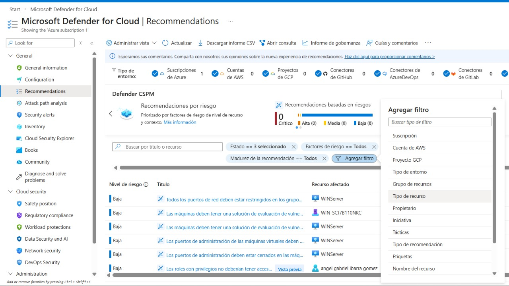
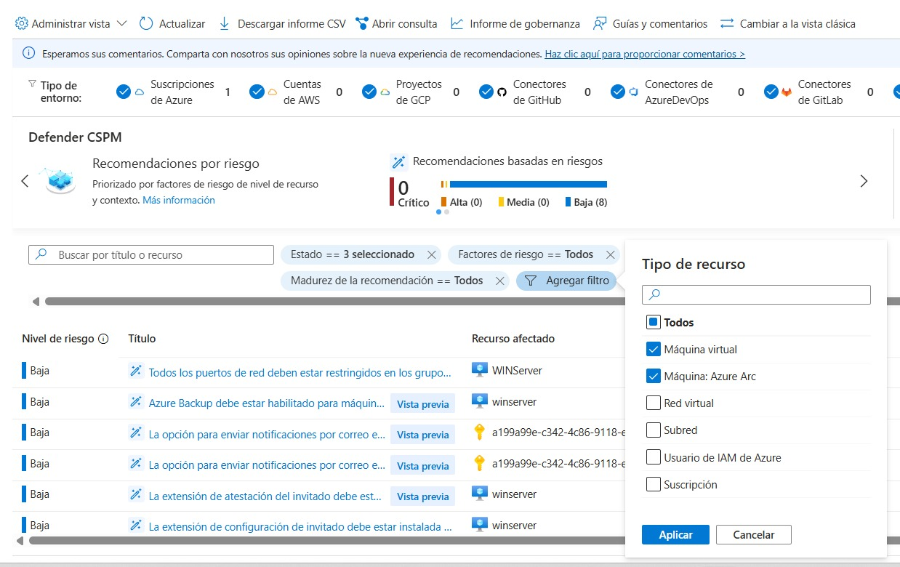
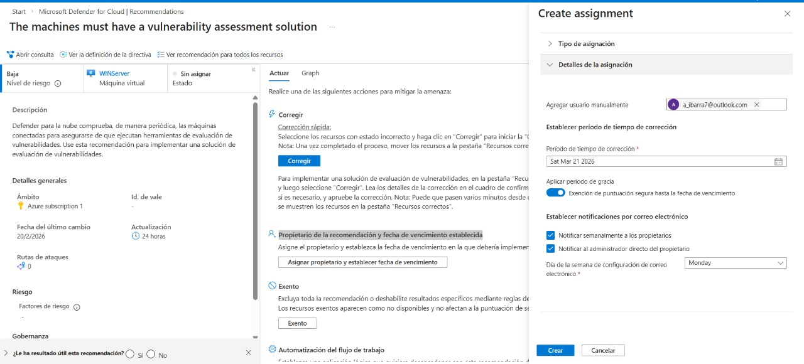

# Tarea 2 – Exploración de Recomendaciones de Seguridad  
## Laboratorio: Microsoft Defender for Cloud (CSPM)

---

## Objetivo

El objetivo de esta tarea es **explorar las recomendaciones de seguridad** generadas por **Microsoft Defender for Cloud**, aplicar filtros por tipo de recurso, y **asignar un propietario junto con una fecha de vencimiento** a una recomendación de seguridad, siguiendo buenas prácticas de **gobernanza y gestión de la postura de seguridad en la nube (CSPM)**.

---

## Entorno del laboratorio

| Elemento               | Descripción                                      |
|------------------------|--------------------------------------------------|
| Suscripción de Azure   | Azure subscription 1                             |
| Plataforma             | Portal de Azure                                  |
| Servicio               | Microsoft Defender for Cloud                     |
| Plan habilitado        | CSPM Fundamental (Gratis) + Defender for Servers Plan 2 |
| Recurso evaluado       | Máquina virtual Windows (Azure / Azure Arc)      |
| Sistema operativo      | Windows Server                                   |

---

## Paso 1 – Acceder a las recomendaciones de seguridad

1. Inicie sesión en el **[Portal de Azure](https://portal.azure.com)**.
2. En el menú de navegación, acceda a:

   **Microsoft Defender for Cloud** → **General** → **Recomendaciones**

3. Verifique que se muestren las recomendaciones de seguridad generadas por el servicio.

---

## Paso 2 – Filtrar recomendaciones por tipo de recurso

1. Seleccione **Agregar filtro**.
2. Elija el filtro **Tipo de recurso**.
3. Marque la opción **Machines – Azure Arc** (si aparece).
4. Haga clic en **Aplicar**.

> **Nota:** Si el filtro *Machines – Azure Arc* no aparece inicialmente, se recomienda actualizar la página.

---

## Paso 3 – Seleccionar una recomendación

1. Identifique una recomendación cuyo estado sea **Sin asignar**.
2. Seleccione cualquiera de las recomendaciones disponibles.

**Ejemplo utilizado en el laboratorio:**  
- *“Las máquinas deben tener una solución de evaluación de vulnerabilidades”*

Esta recomendación indica que la máquina virtual no cuenta con una herramienta activa para la evaluación continua de vulnerabilidades.

---

## Paso 4 – Asignar propietario y fecha de vencimiento

1. Dentro de la recomendación seleccionada, desplácese hasta la sección **Propietario de la recomendación y fecha de vencimiento establecida**.
2. Seleccione la opción para crear la asignación.

### Configuración aplicada:

| Campo                     | Valor                                        |
|---------------------------|----------------------------------------------|
| Tipo de asignación        | Defender for Cloud                           |
| Propietario               | Correo electrónico del administrador         |
| Nivel de riesgo           | Bajo                                         |
| Fecha de vencimiento      | 30 días a partir de la fecha actual          |
| Período de gracia         | Habilitado                                   |
| Notificaciones por correo | Opcional (configuración semanal recomendada) |

3. Seleccione **Create** para guardar la asignación.

---

## Paso 5 – Verificación del resultado

Una vez creada la asignación, se validó que:

- El estado de la recomendación cambió de **Sin asignar** a **En hora**.
- El propietario aparece correctamente asignado.
- La fecha de vencimiento está visible.
- La recomendación permanece activa y bajo control de gobernanza.

---

## Buenas prácticas de gobernanza aplicadas

| Nivel de riesgo | SLA recomendado |
|-----------------|-----------------|
| Crítico         | 7 días          |
| Alto            | 14 días         |
| Medio           | 30 días         |
| Bajo            | 30–45 días      |

Dado que la recomendación evaluada tenía **nivel de riesgo bajo**, se asignó un plazo de **30 días**, alineado con prácticas profesionales de seguridad.

---

## Resultados obtenidos

- Recomendación de seguridad analizada  
- Filtro aplicado correctamente  
- Propietario asignado  
- Fecha de vencimiento configurada  
- Gobernanza de seguridad establecida  
- **Tarea 2 completada exitosamente**

---

## Aprendizajes clave

- Uso de Microsoft Defender for Cloud para CSPM.
- Interpretación de recomendaciones de seguridad.
- Aplicación de gobernanza y responsabilidad.
- Gestión de SLAs según nivel de riesgo.
- Flujo de trabajo típico de un analista de seguridad (SecOps).

---

## Conclusión

Esta tarea permitió comprender cómo **Microsoft Defender for Cloud** facilita la gestión de la postura de seguridad mediante recomendaciones accionables y controles de gobernanza. La asignación de propietarios y fechas de vencimiento asegura la responsabilidad, el seguimiento y la mejora continua de la seguridad en entornos de nube e híbridos.
