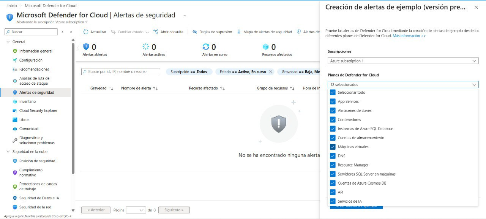
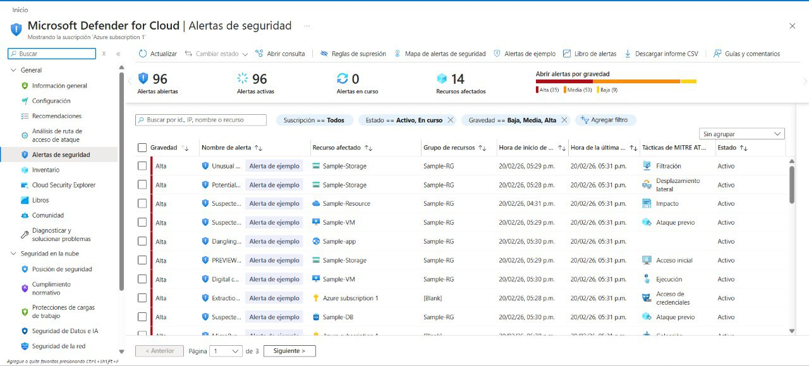
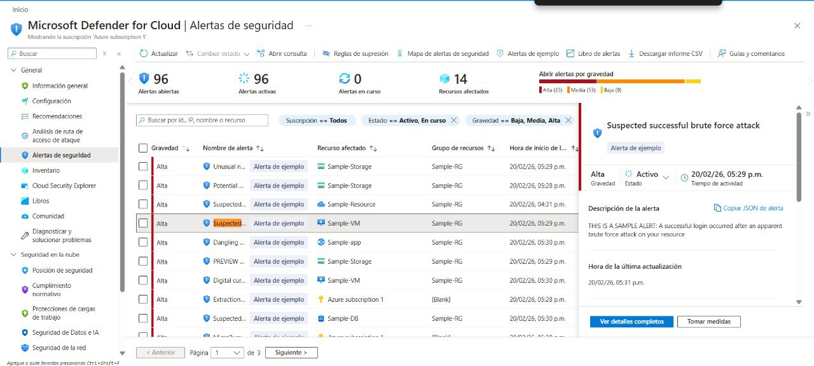
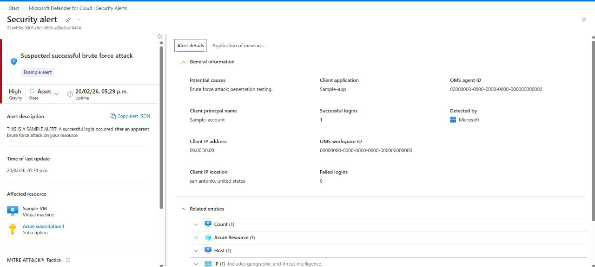
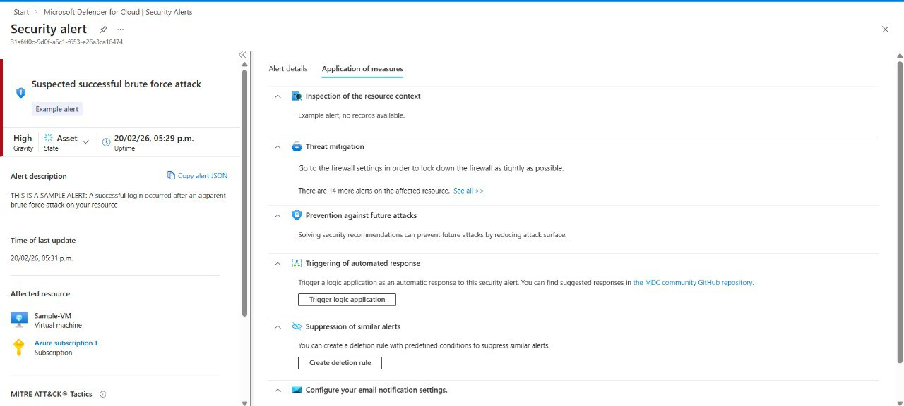

# Taller 3 – Mitigación y Gestión de Alertas de Seguridad  
## Microsoft Defender for Cloud

---

## Objetivo

En esta tarea se generaron alertas de seguridad de muestra en Microsoft Defender for Cloud con el propósito de:

- Analizar alertas de severidad alta.
- Revisar información técnica detallada.
- Evaluar opciones de mitigación.
- Aplicar un flujo básico de gestión de incidentes (SOC).
- Comprender cómo responder ante amenazas en la nube.

---

## Entorno Utilizado

- Plataforma: Microsoft Azure
- Servicio: Microsoft Defender for Cloud
- Suscripción: Azure subscription 1
- Tipo de alertas: Alertas de muestra (Preview)

---

## Paso 1 – Acceso a Alertas de Seguridad

1. Iniciar sesión en el Portal de Azure.
2. Ir a:

   **Microsoft Defender for Cloud** → **General** → **Alertas de seguridad**

3. Inicialmente no había alertas activas.

---

## Paso 2 – Creación de Alertas de Muestra

1. Seleccionar **Alertas de muestra** desde la barra superior.
2. Verificar:
   - Suscripción correcta seleccionada.
   - Todos los planes de Defender for Cloud activos.
3. Seleccionar:

   **Crear alertas de muestra**

4. Esperar la notificación:

   "Alertas de muestra creadas exitosamente"

5. Presionar **Actualizar**.

**Resultado:**

- 96 alertas abiertas.
- 35 alertas de severidad Alta.
- 14 recursos afectados.

---

## Paso 3 – Selección de Alerta Crítica

Se seleccionó la siguiente alerta:

### Suspected successful brute force attack

| Campo | Valor |
|-------|--------|
| Severidad | High |
| Recurso afectado | Sample-VM |
| Tipo de recurso | Virtual Machine |
| Táctica MITRE ATT&CK | Previous attack |
| Detectado por | Microsoft |
| Hora de detección | 20/02/26 – 05:29 p.m. |

---

## Paso 4 – Revisión de Detalles Técnicos

### Descripción

> A successful login occurred after an apparent brute force attack on your resource.

### Interpretación

Se detectaron múltiples intentos de autenticación y posteriormente un inicio de sesión exitoso, lo cual es característico de un ataque de fuerza bruta.

### Información Técnica Analizada

- Client principal name: Sample-account
- Client IP address: 00.00.00.00
- Ubicación IP: San Antonio, United States
- Aplicación cliente: Sample-app
- Logins exitosos: 1
- Logins fallidos: 0

---
## 🔎 Ver detalles completos (View full details)

Al seleccionar **View full details** en la alerta de severidad Alta, se mostró la información completa del incidente, incluyendo:

- ID de la alerta
- Nombre: Suspected prompt injection using ASCII smuggling detected
- Estado: Activo
- Gravedad: Alta
- Recurso afectado (Sample-Deployment – gpt-35-turbo)

La descripción indicaba una posible **prompt injection mediante ASCII smuggling**, mostrando además posibles causas, pasos de investigación y entidades relacionadas.

---

## Paso 5 – Análisis en la Sección “Tomar acción”

Se revisaron las siguientes áreas:

### 1. Inspección del contexto del recurso

- No había registros disponibles (alerta de ejemplo).
- En un entorno real se revisarían logs de autenticación y actividad.

### 2. Mitigación de la amenaza

Recomendación del sistema:
- Revisar configuración de firewall.
- Restringir acceso externo.

### 3. Prevención de futuros ataques

- Resolver recomendaciones de seguridad.
- Reducir superficie de ataque.
- Aplicar configuraciones seguras.

### 4. Activación de respuesta automática

Posibilidad de:
- Configurar Logic Apps.
- Automatizar respuesta.
- Integrar con SIEM (Microsoft Sentinel).

### 5. Supresión de alertas similares

Disponible para falsos positivos. No se utilizó.

---

## Gestión del Incidente (Simulación SOC)

Para aplicar un flujo profesional de gestión de incidentes se realizó:

- **Cambio de estado:** La alerta fue marcada como **En investigación**.
- **Comentario agregado:**

  > Se analiza posible ataque de fuerza bruta. Se recomienda cambio inmediato de credenciales, habilitación de MFA y revisión de logs de autenticación.

Esto demuestra aplicación de proceso de respuesta ante incidentes.

---

## Acciones que se Ejecutarían en un Entorno Real

Si esta alerta fuera real, se realizarían las siguientes acciones:

1. Restablecer contraseña del usuario afectado.
2. Habilitar autenticación multifactor (MFA).
3. Revisar registros de inicio de sesión.
4. Bloquear IP sospechosa.
5. Restringir acceso RDP/SSH.
6. Verificar movimiento lateral.
7. Aplicar principio de mínimo privilegio.
8. Activar monitoreo continuo.

---

## Impacto Potencial del Ataque

Un ataque exitoso de fuerza bruta puede generar:

- Acceso no autorizado.
- Robo de información.
- Instalación de malware.
- Escalada de privilegios.
- Movimiento lateral.
- Compromiso total del recurso.

---

## Aprendizajes Clave

- Cómo generar alertas de muestra.
- Cómo analizar alertas de severidad Alta.
- Interpretación de tácticas MITRE ATT&CK.
- Revisión de contexto técnico.
- Aplicación de flujo básico SOC.
- Diferencia entre alerta real y alerta de ejemplo.
- Importancia de mitigación y prevención.

---

## Conclusión

El Taller 3 permitió comprender el proceso completo de gestión de alertas en Microsoft Defender for Cloud, incluyendo:

- Generación de alertas simuladas.
- Análisis técnico detallado.
- Evaluación de impacto.
- Revisión de opciones de mitigación.
- Aplicación de gestión de incidentes.

Aunque se trató de alertas de ejemplo, el ejercicio replica el flujo real de trabajo de un analista de seguridad en la nube.
