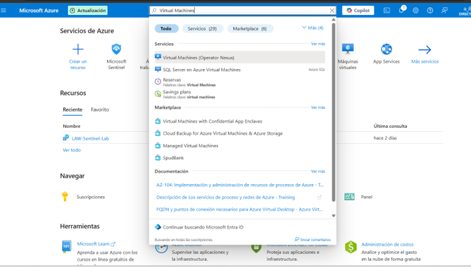
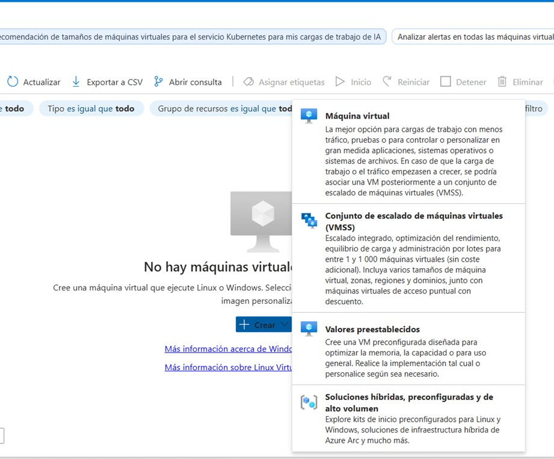
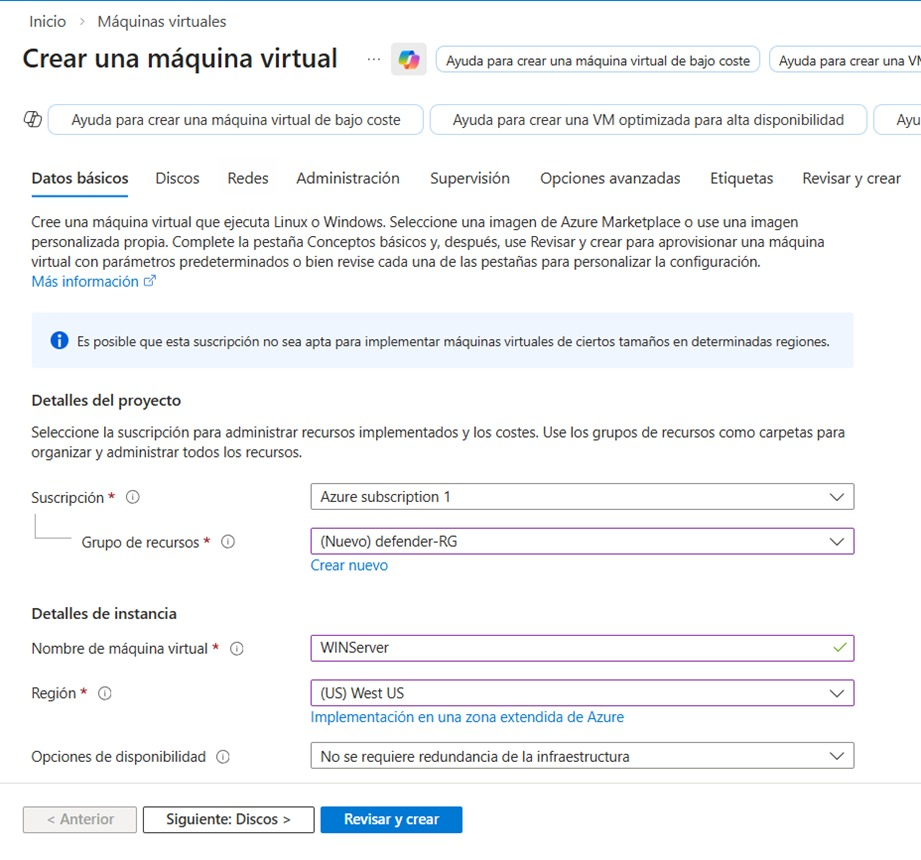
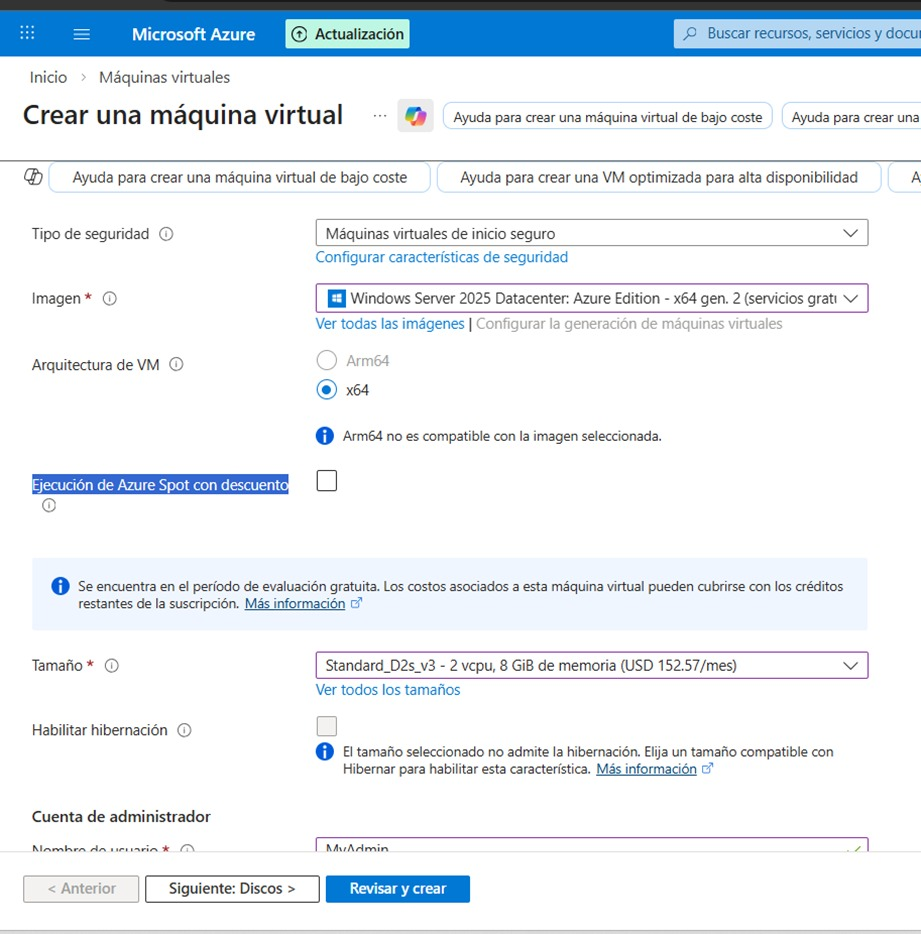

# Documentación completa – Creación de una máquina virtual Windows Server en Azure (paso a paso)

Esta guía describe el proceso detallado para crear una máquina virtual con **Windows Server 2025 Datacenter** en Microsoft Azure, utilizando una suscripción gratuita. El objetivo es obtener un entorno funcional para laboratorios de seguridad, pruebas de **Microsoft Defender for Cloud** y prácticas para la certificación **SC-200**.

## 📋 Requisitos previos

- Una cuenta de Microsoft Azure activa.
- Una suscripción válida (gratuita o de pago) con crédito disponible.
- Cliente de Escritorio Remoto (RDP) instalado en tu equipo local.

---

## 🚀 Paso a paso

### 1. Ingreso al portal de Azure

1. Abre el navegador y accede a [https://portal.azure.com](https://portal.azure.com).
2. Inicia sesión con tu cuenta de Microsoft.
3. Verifica que la suscripción activa sea la correcta (por ejemplo: *Azure Subscription 1* – versión gratuita).

---

### 2. Crear un recurso de máquina virtual

1. En el menú izquierdo, selecciona **Crear un recurso**.
2. En la barra de búsqueda escribe **Virtual Machine**.
3. Selecciona **Crear** > **Máquina virtual**.
4. Se abrirá el asistente de configuración.

---

### 3. Configuración de los datos básicos

#### 3.1 Detalles del proyecto
- **Suscripción**: Azure Subscription 1.
- **Grupo de recursos**: Crear nuevo → `defender-RG`.

#### 3.2 Detalles de la instancia
- **Nombre de la máquina virtual**: `WINServer`.
- **Región**: West US.
- **Opciones de disponibilidad**: No se requiere redundancia (opción por defecto).

#### 3.3 Tipo de seguridad
- Deja la opción predeterminada: **Máquinas virtuales de inicio seguro**.

---

### 4. Selección de la imagen

En la sección **Imagen**, elige:
- **Windows Server 2025 Datacenter: Azure Edition – x64 Gen 2**.

> ⚠ **Nota**: Verifica que la arquitectura sea **x64** (no Arm64). Azure permite usar esta imagen dentro del plan gratuito.

---

### 5. Selección del tamaño de la VM

1. Haz clic en **Ver todos los tamaños** o en la lista desplegable.
2. Selecciona **Standard_D2s_v3**:
   - 2 vCPUs
   - 8 GB de RAM
   - Compatible con el crédito gratuito.
   - Buen rendimiento para laboratorios.
     

---

### 6. Configurar cuenta de administrador

- **Nombre de usuario**: `AdminUser` (no uses `admin` porque es una palabra reservada).
- **Contraseña**: Crea una contraseña segura y confírmala.
  
  

---

### 7. Configuración de puertos de red

En **Reglas de puerto de entrada**:
- Selecciona **Permitir los puertos seleccionados**.
- Elige **RDP (3389)**.

Esto habilita la conexión mediante Escritorio Remoto desde tu PC.

---

### 8. Revisar y crear

1. Haz clic en **Revisar y crear**.
2. Azure validará la configuración. Si todo es correcto, verás el mensaje *Validación superada*.
3. Pulsa **Crear**.

La implementación tomará unos minutos. Espera a que aparezca el mensaje *Se completó la implementación*.

---

### 9. Conexión a la máquina virtual

1. Ve al recurso creado (`WINServer`).
2. En el menú superior, haz clic en **Conectar** > **RDP**.
3. Descarga el archivo `.rdp`.
4. Abre el archivo descargado y acepta la advertencia de seguridad.
5. Ingresa las credenciales:
   - **Usuario**: `AdminUser`
   - **Contraseña**: la que configuraste.
6. Acepta el certificado si se solicita.

Listo, ya tendrás el escritorio de Windows Server funcionando en Azure.

---

### 10. Resultado final

La máquina virtual **Windows Server 2025 Datacenter** está creada y operativa. Ahora puedes utilizarla para:
- Laboratorios de **Microsoft Defender for Cloud**.
- Pruebas de seguridad con **SC-200**.
- Cualquier otro escenario de pruebas o desarrollo.

---

